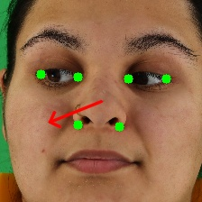
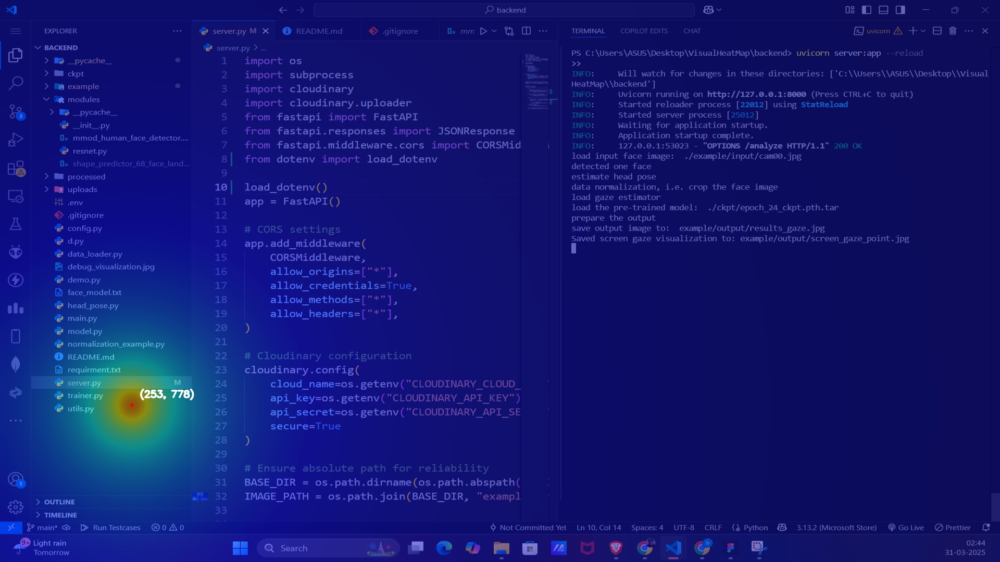

### **📌 Visual Heat Map**

**A FastAPI-based backend for analyzing and visualizing heat maps from gaze data.**

---

## 🚀 **Features**

✅ Generate visual heat maps from gaze data  
✅ Upload and retrieve processed images using Cloudinary  
✅ FastAPI-based backend with seamless frontend integration  
✅ Cross-Origin Resource Sharing (CORS) enabled for smooth communication

---

## 📷 **Demo**





---

## 🛠️ **Installation & Setup**

### **1⃣ Clone the repository**

```sh
git clone https://github.com/ClarityUX-sub/backend.git
cd backend
```

### **2⃣ Create a virtual environment (Optional but recommended)**

```sh
python -m venv venv
source venv/bin/activate  # On macOS/Linux
venv\Scripts\activate  # On Windows
```

### **3⃣ Install dependencies**

```sh
pip install -r requirements.txt
```

### **4⃣ Configure Cloudinary**

Create a `.env` file and add your Cloudinary credentials:

```
CLOUD_NAME=your_cloud_name
API_KEY=your_api_key
API_SECRET=your_api_secret
```

---

## 🔥 **Usage**

### **Run the FastAPI backend**

```sh
uvicorn main:app --reload
```

Access API docs at: [http://127.0.0.1:8000/docs](http://127.0.0.1:8000/docs)

### **Trigger Analysis**

Send a GET request to:

```sh
http://127.0.0.1:8000/analyze
```

---

## 💂️ **Project Structure**

```
📂 backend
 ┓ 📂 example
 ┃ ┓ 📄 input.jpg
 ┃ ┗ 📄 output.jpg
 ┓ 📂 ckpt
 ┃ ┗ 📄 epoch_24_ckpt.pth.tar
 ┓ 📂 modules
 ┃ ┗ 📄 shape_predictor_68_face_landmarks.dat
 ┓ 📄 main.py
 ┓ 📄 d.py
 ┓ 📄 requirements.txt
 ┗ 📄 README.md
```

---

## 🤝 **Contributing**

Want to contribute? Follow these steps:

1. Fork the repo
2. Create a new branch (`feature-branch`)
3. Commit your changes
4. Push and create a PR 🎉

---

## 🐜 **License**

This project is licensed under the MIT License.
